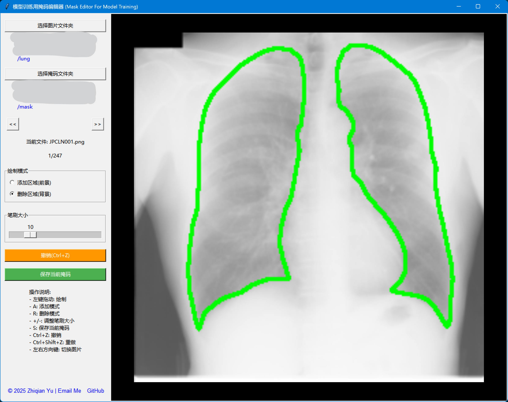

🇨🇳 [中文说明](#中文说明) | 🌐 [English Instructions](#english-instructions)

## 中文说明

🫁🖌️ 一款交互式的肺部掩码编辑器，适用于医学图像分割的标注精修任务，特别适用于肺炎X光图像的研究与伪标签优化。

## 🖼️ 软件界面预览



### 核心功能

- 加载肺部图像与对应掩码
- 显示带有轮廓的图像
- 鼠标笔刷工具支持添加/删除区域
- 可调整笔刷大小、模式（添加/删除）
- 支持撤销操作、键盘快捷键导航
- 掩码保存回原文件夹

### 快捷键

| 快捷键 | 功能           |
|--------|----------------|
| A      | 添加白色区域   |
| R      | 删除黑色区域   |
| S      | 保存当前掩码   |
| Ctrl+Z | 撤销上一步     |
| ←/→    | 切换图片       |
| +/-    | 调整笔刷大小   |

### 运行方式

```bash
pip install opencv-python pillow numpy
python lung_mask_editor.py
```

## 授权声明

本软件仅供个人非商业用途，使用时须注明作者。
禁止未经许可的商业使用。

📧 联系方式：yu-zhiqian@outlook.com
© 2025 Zhiqian Yu

## 📚 引用

如果您在学术研究中使用了此工具，请这样引用：

> Yu, Z. (2025). *LungMaskEditor: An Interactive Mask Refinement Tool (for Chest X-ray Segmentation)*. Version 1.0. Available at: https://github.com/zhiqianyu/AI-Training-Mask-Editor

BibTeX:
```bibtex
@misc{yu2025lungmaskeditor,
  author       = {Yu, Zhiqian},
  title        = {LungMaskEditor: An Interactive Mask Refinement Tool for Chest X-ray Segmentation},
  year         = {2025},
  howpublished = {\url{https://github.com/zhiqianyu/AI-Training-Mask-Editor}},
  note         = {Version 1.0. Personal and research use. Commercial use requires permission.}
}
```

---

## English Instructions

# LungMaskEditor 🫁🖌️

An interactive GUI tool for editing lung region segmentation masks based on chest X-ray images. Designed for research and annotation refinement tasks in medical imaging workflows.

## 🖼️ Software Screenshot


## Features

- Load paired lung images and binary mask files
- Visualize lung images overlaid with mask contours
- Add/remove mask regions using mouse brush
- Adjustable brush size and drawing mode (add/remove)
- Undo editing history
- Keyboard shortcuts for rapid editing
- Save edited masks back to original folder

## Keyboard Shortcuts

| Key | Function              |
|-----|-----------------------|
| A   | Add region (white)    |
| R   | Remove region (black) |
| S   | Save current mask     |
| Ctrl+Z | Undo last action   |
| ←/→  | Navigate images      |
| +/- | Adjust brush size     |

## Installation

```bash
pip install opencv-python pillow tkinter numpy
```

## Run the App

```bash
python lung_mask_editor.py
```

## License

This tool is licensed for **personal, non-commercial use only**.  
Commercial use is strictly prohibited without written permission.

📧 Contact: yu-zhiqian@outlook.com  
© 2025 Zhiqian Yu

## 📚 Citation

If you use this tool in academic publications, please cite it as:

> Yu, Z. (2025). *LungMaskEditor: An Interactive Mask Refinement Tool (for Chest X-ray Segmentation)*. Version 1.0. Available at: https://github.com/zhiqianyu/AI-Training-Mask-Editor

BibTeX:
```bibtex
@misc{yu2025lungmaskeditor,
  author       = {Yu, Zhiqian},
  title        = {LungMaskEditor: An Interactive Mask Refinement Tool for Chest X-ray Segmentation},
  year         = {2025},
  howpublished = {\url{https://github.com/zhiqianyu/AI-Training-Mask-Editor}},
  note         = {Version 1.0. Personal and research use. Commercial use requires permission.}
}
```